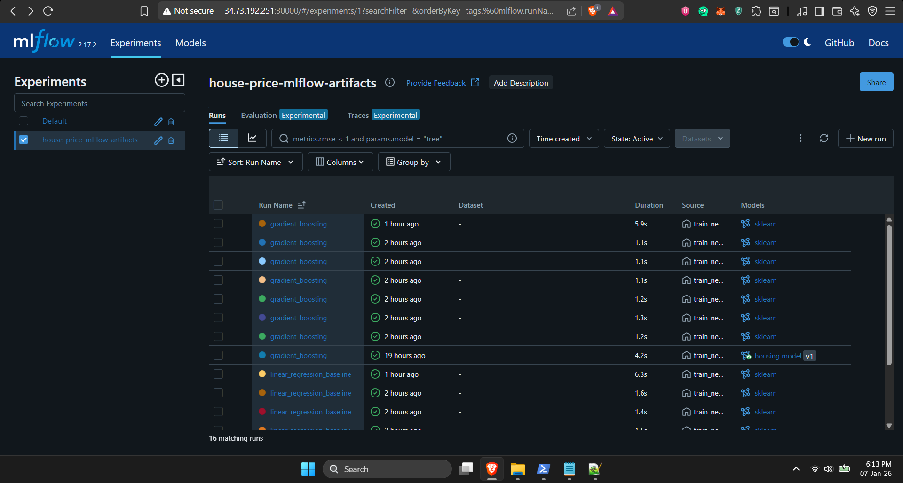
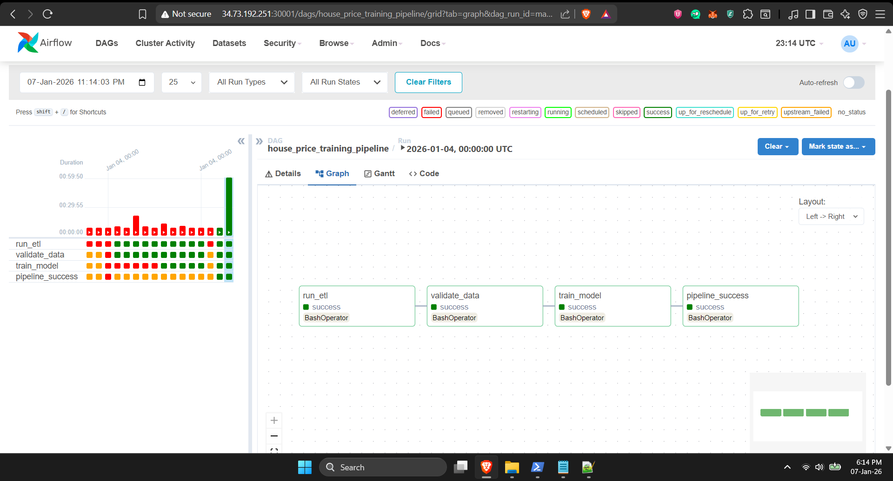
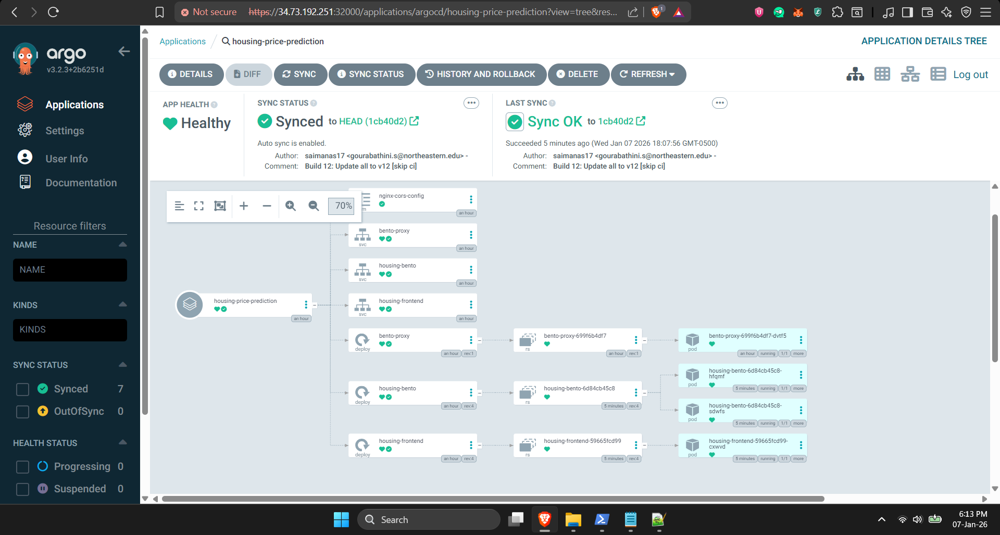
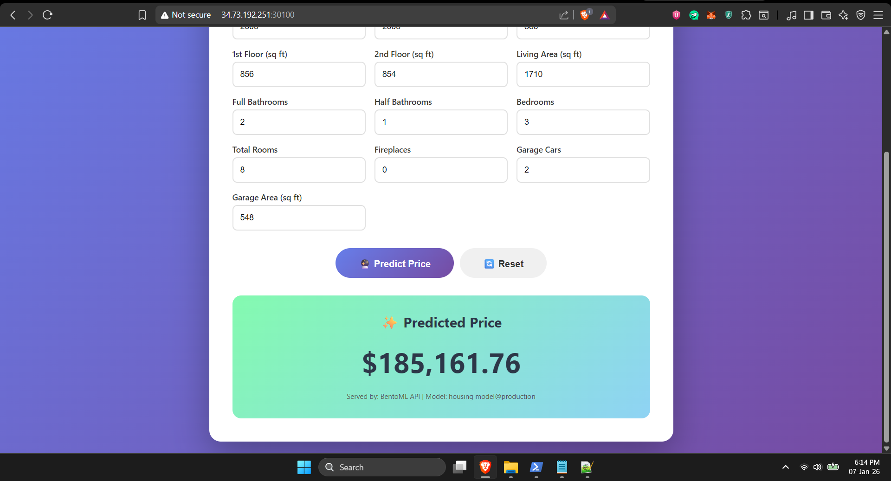

# House Price Prediction - End-to-End MLOps Pipeline

An end-to-end machine learning operations (MLOps) project demonstrating automated model training, deployment, and monitoring using modern DevOps practices.

## 🎯 Project Overview

This project implements a complete MLOps pipeline for predicting house prices using the Ames Housing dataset. The system automates the entire ML lifecycle from data processing to model deployment with continuous integration and GitOps-based deployment.

## 🏗️ Architecture

### Components:
- **Data Pipeline**: Automated ETL for data preprocessing and feature engineering
- **Model Training**: Gradient Boosting Regressor with hyperparameter optimization
- **Experiment Tracking**: MLflow for tracking experiments, metrics, and model versioning
- **Model Registry**: MLflow Model Registry with production aliasing
- **Model Serving**: BentoML API for real-time predictions
- **Orchestration**: Apache Airflow for pipeline automation
- **CI/CD**: Jenkins pipeline with GitOps workflow
- **Deployment**: ArgoCD for continuous deployment to Kubernetes
- **Frontend**: Interactive web UI for model predictions

### MLOps Pipeline Flow:


*MLflow tracking multiple training runs with experiment metrics*


*Airflow DAG executing end-to-end pipeline successfully*


*ArgoCD syncing deployments from Git to Kubernetes*


*Interactive web interface for house price predictions*

## 🚀 Tech Stack

**Infrastructure & Orchestration:**
- Kubernetes (K3s)
- Apache Airflow
- PostgreSQL
- Docker

**ML & Tracking:**
- Python 3.12
- Scikit-learn
- MLflow
- Pandas, NumPy

**Model Serving:**
- BentoML
- Flask (alternative implementation)
- Nginx (CORS proxy)

**CI/CD & GitOps:**
- Jenkins
- ArgoCD
- GitHub

## 📊 Model Performance

- **Algorithm**: Gradient Boosting Regressor
- **Baseline (Linear Regression)**: RMSE $17,203
- **Final Model**: RMSE $14,293
- **Improvement**: 25% reduction in error
- **Test R²**: 0.9734 (97.34% accuracy)

**Key Features Used:**
- Total Square Footage (40.5% importance)
- Overall Quality (29.5% importance)
- Price per Square Foot (16% importance)

## 🔄 Pipeline Flow
```
Raw Data (Kaggle) 
    ↓
ETL Pipeline (Airflow)
    ↓
Feature Engineering
    ↓
Model Training (MLflow Tracking)
    ↓
Model Validation
    ↓
MLflow Model Registry
    ↓
BentoML Service (K8s)
    ↓
Frontend UI
```

## 📁 Project Structure
```
├── bentoml/              # BentoML service definition
├── dags/                 # Airflow DAG definitions
├── data/                 # Raw and processed datasets
├── frontend/             # Web UI
├── k8s/                  # Kubernetes manifests
├── scripts/              # ETL and training scripts
├── app-k8s/              # ArgoCD-managed deployments
└── Jenkinsfile           # CI/CD pipeline definition
```

## 🎯 Key Features

### Data Pipeline
- Automated data validation and quality checks
- Feature engineering (house age, total SF, price per sqft)
- Train/validation/test split (60/20/20)

### Model Training
- Baseline model comparison (Linear Regression vs Gradient Boosting)
- Hyperparameter tuning
- Cross-validation
- Feature importance analysis

### MLOps Best Practices
- **Experiment Tracking**: All runs logged to MLflow with metrics and artifacts
- **Model Versioning**: MLflow Model Registry with production aliases
- **Automated Retraining**: Weekly scheduled retraining via Airflow
- **CI/CD**: Automated build and deployment pipeline
- **GitOps**: ArgoCD syncs deployments from Git
- **Monitoring**: Model performance validation in pipeline

## 🌐 Deployed Services

All services are deployed on Kubernetes (K3s cluster):

- **MLflow UI**: Experiment tracking and model registry
- **Airflow UI**: Pipeline monitoring and orchestration
- **BentoML API**: Model prediction endpoint
- **Frontend**: Interactive prediction interface

Airflow and MLflow are installed as pods in the cluster. All deployment manifests are available in this repository.

## 🔧 CI/CD Workflow

### Jenkins Pipeline:
1. **Build**: Containerize BentoML service and Frontend
2. **Push**: Upload images to Docker Hub with version tags
3. **Update Manifests**: Modify Kubernetes YAMLs in `app-k8s/` folder
4. **Commit**: Push manifest changes to Git with `[skip ci]` tag
5. **Deploy**: ArgoCD automatically syncs and deploys to Kubernetes

### Airflow DAG:
Scheduled to run weekly (`@weekly`):
1. **ETL**: Process raw data
2. **Validate**: Check data quality
3. **Train**: Train models and log to MLflow
4. **Success**: Pipeline completion notification

## 📝 Model Deployment Strategy

Models are served through a multi-layered architecture:
- **Model Storage**: MLflow artifacts with HTTP serving
- **Model Loading**: BentoML loads from MLflow Model Registry (`@production` alias)
- **API Gateway**: Nginx proxy for CORS handling
- **Kubernetes**: 2 replicas for high availability

## 🔍 Why This Tech Stack?

**MLflow over alternatives**: Provides both experiment tracking and model registry in one tool, with excellent Python integration.

**BentoML over Flask**: ML-specific serving framework with better performance and built-in features, though Flask alternative is also implemented for comparison.

**Airflow over alternatives**: Industry-standard for ML pipeline orchestration with rich UI and extensive operator library.

**K3s**: Lightweight Kubernetes perfect for single-node deployments and learning environments.

**GitOps with ArgoCD**: Declarative deployment strategy with Git as single source of truth.

## 🎓 Learning Outcomes

This project demonstrates:
- End-to-end ML pipeline development
- MLOps best practices and tooling
- Kubernetes deployment patterns
- CI/CD automation
- GitOps workflows
- Model versioning and registry management
- API design for ML models
- Infrastructure as Code

## 📌 Future Enhancements

- Data version control with DVC
- Model monitoring and drift detection
- A/B testing for model versions
- Automated model promotion based on performance thresholds
- Cloud storage integration (GCS/S3) for artifacts
- Prometheus metrics for API monitoring
- Grafana dashboards for observability

